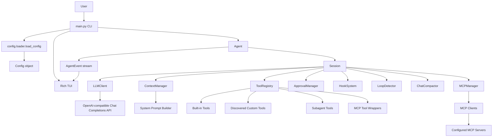
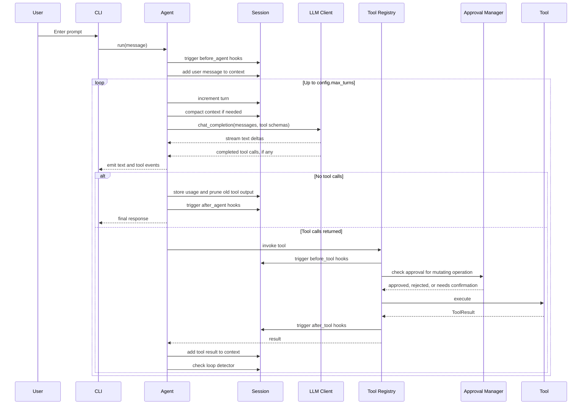
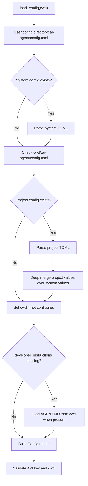
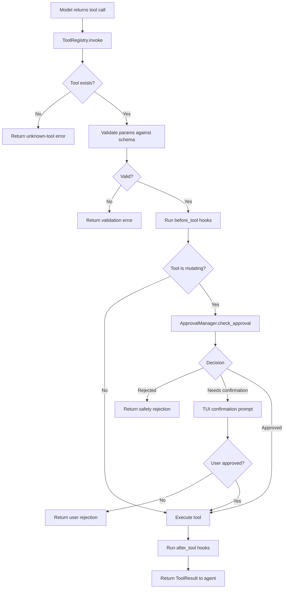
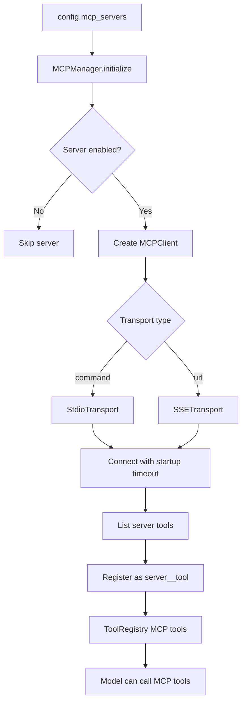
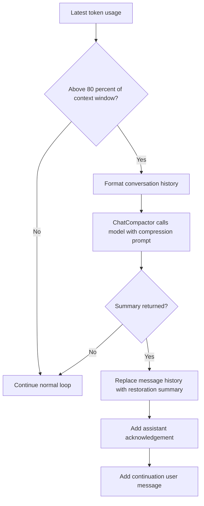

# Soren Code

Soren Code is a terminal-based Python agent runtime for software engineering tasks. It wraps an OpenAI-compatible Chat Completions API client with streamed responses, function calling, a built-in tool system, safety approvals, context management, session persistence, Model Context Protocol integration, hooks, and specialized subagents.

The project is designed around a simple loop: read the user's request, send the conversation and available tool schemas to the model, execute requested tools, feed tool results back into the conversation, and continue until the model returns a final answer.

## Table of Contents

- [Core Capabilities](#core-capabilities)
- [Repository Structure](#repository-structure)
- [Runtime Architecture](#runtime-architecture)
- [Request Lifecycle](#request-lifecycle)
- [Installation](#installation)
- [Configuration](#configuration)
- [Running the Agent](#running-the-agent)
- [Interactive Commands](#interactive-commands)
- [Tool System](#tool-system)
- [Built-In Tools](#built-in-tools)
- [Custom Tool Discovery](#custom-tool-discovery)
- [Subagents](#subagents)
- [MCP Integration](#mcp-integration)
- [Context Management](#context-management)
- [Safety and Approval Model](#safety-and-approval-model)
- [Hooks](#hooks)
- [Session Persistence](#session-persistence)
- [Terminal UI](#terminal-ui)
- [Important Implementation Notes](#important-implementation-notes)

## Core Capabilities

- Interactive terminal chat and single-prompt execution.
- Streaming assistant responses through a Rich-powered terminal interface.
- OpenAI-compatible function calling with tool schema generation from Pydantic models.
- Built-in tools for reading files, writing files, exact-string edits, shell commands, directory listing, regex search, glob search, web search, web fetch, memory, and session todos.
- Project and user-level custom tool discovery from `.ai-agent/tools`.
- MCP server support through stdio and SSE transports.
- Configurable approval policies for mutating operations.
- Hook execution before and after agent runs and tool calls.
- Conversation compaction when token usage approaches the configured context window.
- Old tool-output pruning to reduce context pressure.
- Loop detection for repeated responses or repeated tool-call cycles.
- Session saving, resuming, checkpointing, and restoring.
- Specialized subagents for codebase investigation and code review.

## Repository Structure

```text
.
|-- main.py                         # CLI entrypoint and interactive command handling
|-- apply_patch.py                  # Standalone patch-tool implementation, not registered by default
|-- README.md                       # Project documentation
|-- .gitignore
|-- .ai-agent/
|   |-- config.toml                 # Example project configuration
|   `-- tools/
|       `-- test_tool.py            # Example discovered custom tool
|-- agent/
|   |-- agent.py                    # Main agent loop
|   |-- events.py                   # Agent event dataclasses and event types
|   |-- persistence.py              # Session and checkpoint storage
|   `-- session.py                  # Runtime container for client, tools, context, MCP, hooks, safety
|-- client/
|   |-- llm_client.py               # Async OpenAI-compatible chat client
|   `-- response.py                 # Stream events, tool-call objects, usage models
|-- config/
|   |-- config.py                   # Pydantic configuration models and enums
|   `-- loader.py                   # System/project config loading and merging
|-- context/
|   |-- compaction.py               # Conversation summarization for context restoration
|   |-- loop_detector.py            # Repeated action and cycle detection
|   `-- manager.py                  # Message storage, system prompt, token accounting, pruning
|-- hooks/
|   `-- hook_system.py              # Hook execution engine
|-- prompts/
|   `-- system.py                   # System prompt and compaction prompt builders
|-- safety/
|   `-- approval.py                 # Approval policies and command safety checks
|-- scripts/
|   `-- test_tool.py                # Example hook script
|-- tools/
|   |-- base.py                     # Tool base classes, results, confirmations, diffs
|   |-- discovery.py                # Custom tool discovery
|   |-- registry.py                 # Tool registration, schema listing, invocation
|   |-- subagents.py                # Subagent tool definitions
|   |-- builtin/                    # Built-in tool implementations
|   `-- mcp/                        # MCP client, manager, and tool wrapper
|-- ui/
|   `-- tui.py                      # Rich terminal rendering and approval prompts
`-- utils/
    |-- errors.py                   # Project-specific exception types
    |-- paths.py                    # Path resolution and file helpers
    `-- text.py                     # Token counting and text truncation
```

## Runtime Architecture



The `Session` object is the runtime hub. It owns the LLM client, tool registry, context manager, MCP manager, hook system, approval manager, loop detector, chat compactor, session identifiers, timestamps, and turn counter.

## Request Lifecycle



## Installation

The repository does not currently include a dependency manifest such as `requirements.txt` or `pyproject.toml`. Install the dependencies imported by the source files directly:

```bash
python -m pip install openai click rich pydantic platformdirs tomli tiktoken fastmcp httpx ddgs
```

Python 3.10 or newer is recommended because the code uses modern type syntax such as `str | None`.

Set the API key expected by `Config.api_key`:

```bash
export API_KEY="your-api-key"
```

On Windows PowerShell:

```powershell
$env:API_KEY = "your-api-key"
```

For providers that expose an OpenAI-compatible API at a custom endpoint, set `BASE_URL`:

```bash
export BASE_URL="https://your-provider.example/v1"
```

If `BASE_URL` is not set, the OpenAI SDK default base URL is used.

## Configuration

Configuration is loaded in this order:



The main configuration model is defined in `config/config.py`.

### Environment Variables

| Variable | Purpose |
| --- | --- |
| `API_KEY` | Required API key passed to `AsyncOpenAI`. |
| `BASE_URL` | Optional OpenAI-compatible API base URL. |

### Important Config Fields

| Field | Type | Default | Purpose |
| --- | --- | --- | --- |
| `model.name` | string | `cohere/north-mini-code:free` | Model sent to the Chat Completions API. |
| `model.temperature` | float | `1` | Sampling temperature. The example project config sets this to `0`. |
| `model.context_window` | integer | `256000` | Context window used by compression checks. |
| `cwd` | path | current directory | Working directory for file and shell tools. |
| `shell_environment.exclude_patterns` | list | `*KEY*`, `*TOKEN*`, `*SECRET*` | Environment variables removed before shell command execution. |
| `shell_environment.set_vars` | table | `{}` | Extra variables injected into shell commands. |
| `hooks_enabled` | boolean | `false` | Enables configured hooks. |
| `hooks` | list | `[]` | Hook definitions. |
| `approval` | enum | `on-request` | Approval policy for mutating operations. |
| `max_turns` | integer | `100` | Maximum turns in the agentic loop. |
| `mcp_servers` | table | `{}` | MCP server definitions. |
| `allowed_tools` | list or null | `null` | Optional allowlist limiting available tools. |
| `developer_instructions` | string or null | `null` | Extra project-maintainer instructions. |
| `user_instructions` | string or null | `null` | Extra user instructions included in the system prompt. |
| `debug` | boolean | `false` | Debug flag available to the runtime. |

### Example Project Configuration

The repository includes `.ai-agent/config.toml`. It enables hooks, sets model temperature to zero, and defines two example MCP servers. Those MCP entries contain machine-specific paths and one intentionally invalid package name, so update or disable them before using MCP in a new environment.

```toml
hooks_enabled = true

[model]
temperature = 0

[[hooks]]
name = "test_before_tool"
trigger = "before_tool"
command = "python3 ./scripts/test_tool.py"

[[hooks]]
name = "test_before_agent"
trigger = "before_agent"
command = "python3 ./scripts/test_tool.py"
```

## Running the Agent

Run a single prompt:

```bash
python main.py "Inspect this repository and summarize it"
```

Start interactive mode:

```bash
python main.py
```

Run with a specific working directory:

```bash
python main.py --cwd /path/to/project
```

In interactive mode, normal text is sent to the agent. Input beginning with `/` is handled as a local CLI command.

## Interactive Commands

| Command | Behavior |
| --- | --- |
| `/help` | Show command help. |
| `/exit`, `/quit` | Exit interactive mode. |
| `/clear` | Clear conversation history and loop detector state. |
| `/config` | Print the active model, temperature, approval policy, working directory, max turns, and hook status. |
| `/model <name>` | Change `config.model.name` for the current process. |
| `/approval <mode>` | Change approval policy for the current process. |
| `/stats` | Show session id, creation time, turn count, message count, token usage, tool count, and MCP count. |
| `/tools` | List currently available tools. |
| `/mcp` | Show configured MCP server status and tool counts. |
| `/save` | Save the current session snapshot. |
| `/sessions` | List saved sessions. |
| `/resume <session_id>` | Load a saved session into the current agent. |
| `/checkpoint` | Save a timestamped checkpoint for the current session. |
| `/restore <checkpoint_id>` | Restore a checkpoint into the current agent. |

## Tool System

Tools are defined by subclassing `tools.base.Tool`.

Each tool provides:

- `name`: the function name exposed to the model.
- `description`: the model-facing tool description.
- `kind`: one of `read`, `write`, `shell`, `network`, `memory`, or `mcp`.
- `schema`: either a Pydantic model or a JSON-schema-like dictionary.
- `execute(invocation)`: asynchronous implementation returning `ToolResult`.
- Optional `get_confirmation(invocation)`: confirmation metadata for mutating operations.

The tool registry handles:

1. Looking up tools by name.
2. Filtering by `config.allowed_tools` when configured.
3. Generating OpenAI-compatible tool schemas.
4. Validating tool parameters through Pydantic.
5. Running before-tool and after-tool hooks.
6. Asking the approval manager about mutating operations.
7. Executing the tool.
8. Returning a normalized `ToolResult`.



## Built-In Tools

| Tool | Kind | Main Parameters | Behavior |
| --- | --- | --- | --- |
| `read_file` | `read` | `path`, `offset`, `limit` | Reads text files with line numbers. Rejects missing paths, directories, binary files, and files larger than 10 MB. Truncates output above roughly 25,000 tokens. |
| `write_file` | `write` | `path`, `content`, `create_directories` | Creates or overwrites a file. Creates parent directories by default. Produces a unified diff for confirmation and result metadata. |
| `edit` | `write` | `path`, `old_string`, `new_string`, `replace_all` | Performs exact string replacement. Requires a unique match unless `replace_all` is true. Can create a new file only when the target does not exist and `old_string` is empty. |
| `shell` | `shell` | `command`, `timeout`, `cwd` | Runs commands through `cmd.exe /c` on Windows or `/bin/bash -c` elsewhere. Timeout range is 1 to 600 seconds. Output is truncated above 100 KB. Dangerous commands are blocked. |
| `list_dir` | `read` | `path`, `include_hidden` | Lists directory entries, sorted with directories first. Hidden files are omitted unless requested. |
| `grep` | `read` | `pattern`, `path`, `case_insensitive` | Searches files with a regular expression and returns matching lines with paths and line numbers. Skips common dependency/cache folders, binary files, and hidden filenames. Searches up to 500 files. |
| `glob` | `read` | `pattern`, `path` | Finds files matching a glob pattern, including recursive `**` patterns. Returns up to 1,000 file paths. |
| `web_search` | `network` | `query`, `max_results` | Uses `ddgs` to run web searches and returns titles, URLs, and snippets. |
| `web_fetch` | `network` | `url`, `timeout` | Fetches `http://` or `https://` URLs with redirects enabled. Response text is truncated above 100 KB. |
| `memory` | `memory` | `action`, `key`, `value` | Stores persistent key-value memory in the platform data directory. Supports `set`, `get`, `delete`, `list`, and `clear`. |
| `todos` | `memory` | `action`, `id`, `content` | Maintains an in-memory task list for the current session. Supports `add`, `complete`, `list`, and `clear`. |

## Custom Tool Discovery

The discovery manager loads Python tools from:

- `<configured cwd>/.ai-agent/tools/*.py`
- `<platform user config dir>/ai-agent/.ai-agent/tools/*.py`

Each file is imported dynamically. Any class that directly subclasses `Tool` and is defined in that module is instantiated and registered.

The included `.ai-agent/tools/test_tool.py` demonstrates the pattern:

```python
class TestTool(Tool):
    name = "test_tool"
    kind = ToolKind.READ
    schema = TestToolParams

    async def execute(self, invocation: ToolInvocation) -> ToolResult:
        ...
```

Discovery ignores files beginning with `__`. Import or registration failures are swallowed, so invalid custom tool files will simply not appear in `/tools`.

## Subagents

Subagents are implemented as tools in `tools/subagents.py`. A subagent starts a nested `Agent` with a modified configuration, a focused system prompt, optional tool allowlisting, a maximum turn count, and a timeout.

| Tool Name | Purpose | Allowed Tools | Limits |
| --- | --- | --- | --- |
| `subagent_codebase_investigator` | Investigates repository structure, implementation patterns, and code questions. | `read_file`, `grep`, `glob`, `list_dir` | 20 turns, 600 seconds |
| `subagent_code_reviewer` | Reviews code for bugs, quality issues, security concerns, and improvements. | `read_file`, `grep`, `list_dir` | 10 turns, 300 seconds |

Subagents return a text summary containing termination reason, tools called, and final result.

## MCP Integration

MCP support is implemented through `fastmcp`.



Each MCP server configuration must define exactly one transport:

- `command` with optional `args`, `env`, and `cwd` for stdio MCP servers.
- `url` for SSE-based MCP servers.

Connected server tools are wrapped as `MCPTool` instances and registered under names like:

```text
filesystem__read_file
```

MCP tools are treated as mutating operations by default, so they pass through the same approval flow as other non-read tools.

## Context Management

The context manager builds the message list sent to the model. It prepends a generated system prompt containing:

- Agent identity and role.
- Current date, operating system, working directory, and shell.
- Available tool guidelines.
- AGENTS.md working rules.
- Security guidelines.
- Optional developer instructions.
- Optional user instructions.
- Persistent memory, when present.
- Operational workflow guidance.

Runtime messages are stored as `MessageItem` objects with role, content, optional tool call id, optional tool calls, token counts, and pruning metadata.

### Compression

Compression is triggered when the latest reported token usage exceeds 80 percent of `config.model.context_window`.



### Tool Output Pruning

After each agent turn, old tool results may be pruned. The current implementation protects approximately the most recent 40,000 tokens of tool output. If older prunable tool output exceeds approximately 20,000 tokens, it replaces those older tool result contents with:

```text
[Old tool result content cleared]
```

### Loop Detection

The loop detector records response signatures and tool-call signatures. It detects:

- The same action repeated three times.
- A repeating cycle of length two or three.

When a loop is detected, the agent adds a loop-breaker prompt to the conversation and asks the model to change strategy.

## Safety and Approval Model

Mutating tools include write tools, shell commands, network tools, memory tools, MCP tools, and subagents. Read-only tools do not normally require confirmation.

Approval decisions are controlled by `ApprovalManager` in `safety/approval.py`.

| Policy | Behavior |
| --- | --- |
| `on-request` | Default. Safe commands are approved automatically. Other mutating operations may require confirmation depending on command/path risk. |
| `on-failure` | Commands are approved automatically unless blocked as dangerous. |
| `auto` | Commands are approved automatically unless blocked as dangerous. |
| `auto-edut` | Enum value currently used for auto-edit behavior. Safe commands are approved, other commands require confirmation. |
| `never` | Safe commands are approved, unsafe commands are rejected. |
| `yolo` | Approves all commands, including commands otherwise considered dangerous. |

Command safety is based on two pattern lists:

- Dangerous patterns include destructive filesystem operations, disk formatting tools, shutdown/reboot commands, root permission changes, listening netcat commands, curl/wget piped into shells, and fork bombs.
- Safe patterns include common read-only commands, read-only git commands, dependency listing commands, text processing commands, system information commands, and process inspection commands.

File-writing tools provide affected paths to the approval manager. Paths inside `config.cwd` are approved by path policy; paths outside the working directory require confirmation.

The shell tool also removes environment variables matching secret-like patterns before command execution unless `shell_environment.ignore_default_excludes` is true.

## Hooks

Hooks are configured through `HookConfig` entries and run only when `hooks_enabled` is true.

Supported triggers:

| Trigger | When It Runs |
| --- | --- |
| `before_agent` | Before a user message enters the agent loop. |
| `after_agent` | After the agent finishes responding. |
| `before_tool` | Before a tool executes. |
| `after_tool` | After a tool returns. |
| `on_error` | Available in the hook system for error handling. |

Each hook can define either:

- `command`: shell command to execute.
- `script`: script content written to a temporary `.sh` file and executed.

Hook processes run with:

| Environment Variable | Meaning |
| --- | --- |
| `AI_AGENT_TRIGGER` | Hook trigger name. |
| `AI_AGENT_CWD` | Configured working directory. |
| `AI_AGENT_TOOL_NAME` | Tool name for tool hooks. |
| `AI_AGENT_TOOL_PARAMS` | JSON-serialized tool parameters for tool hooks. |
| `AI_AGENT_TOOL_RESULT` | Tool output for after-tool hooks. |
| `AI_AGENT_USER_MESSAGE` | User message for agent hooks. |
| `AI_AGENT_RESPONSE` | Final response for after-agent hooks. |
| `AI_AGENT_ERROR` | Error text for error hooks. |

The included `scripts/test_tool.py` is an example hook script that writes hook metadata to a log file.

## Session Persistence

Session persistence is handled by `PersistenceManager`.

Saved sessions and checkpoints are stored under the platform data directory for the `ai-agent` application:

```text
<platform data dir>/ai-agent/sessions/
<platform data dir>/ai-agent/checkpoints/
```

A `SessionSnapshot` contains:

- `session_id`
- `created_at`
- `updated_at`
- `turn_count`
- `messages`
- `total_usage`

Sessions are saved as JSON. On Unix-like systems, session and checkpoint directories are set to `0700`, and individual JSON files are set to `0600`.

## Terminal UI

The terminal UI is implemented with Rich in `ui/tui.py`.

It renders:

- A welcome panel showing the model, working directory, and common commands.
- Streaming assistant text.
- Tool-call start panels with ordered arguments.
- Tool-call completion panels with specialized formatting per tool type.
- Syntax-highlighted file reads and diffs.
- Shell command output and exit codes.
- Directory, grep, glob, web, todo, and memory summaries.
- Approval prompts with command or diff previews.

Tool colors are based on `ToolKind`, making read, write, shell, network, memory, and MCP operations visually distinct.

## Important Implementation Notes

- There is no current dependency manifest. Add one before distributing or deploying the project.
- The project directory does not include a `.git` folder in the provided workspace snapshot.
- `.ai-agent/config.toml` contains example MCP commands and absolute paths from another machine. Update these before running with hooks or MCP enabled.
- `apply_patch.py` is not registered in `tools/builtin/__init__.py` and imports `unified_agent.tools.base`, which is not present in this repository. Treat it as an unfinished or external helper unless it is corrected and registered.
- The approval enum value for auto-edit mode is currently spelled `auto-edut` in code.
- The TUI help text references `/checkpoints`, but `main.py` does not currently implement a `/checkpoints` command handler.
- The hook script uses a hard-coded example log path. Update it for your environment if hooks are enabled.
- The repository includes a sample custom tool and a sample hook script, but no automated test suite.
